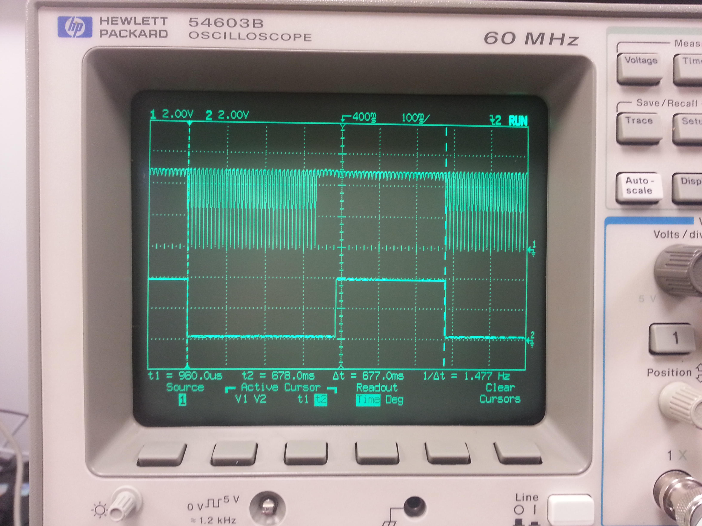
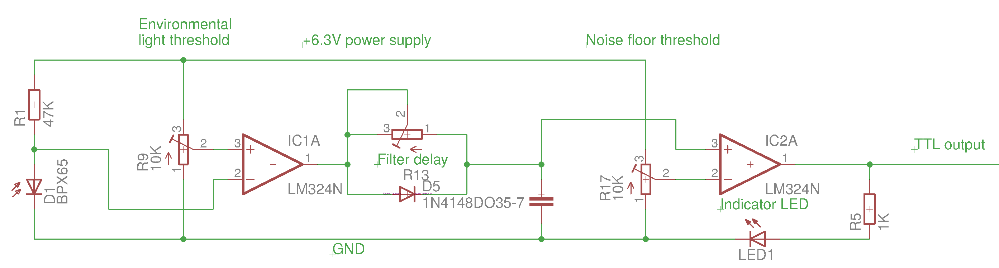
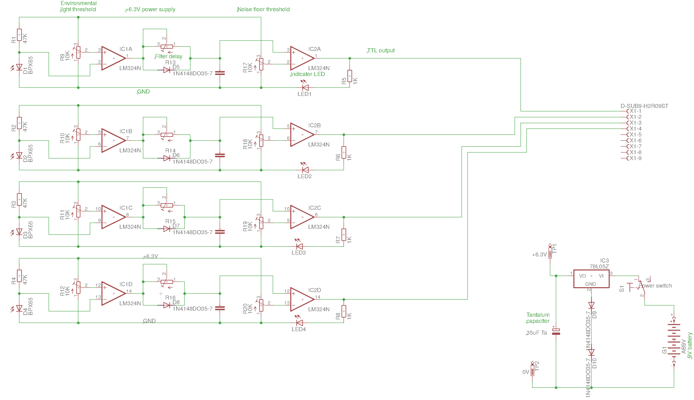
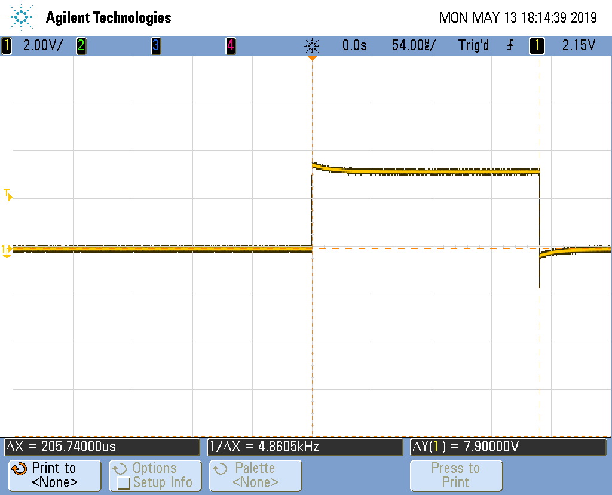
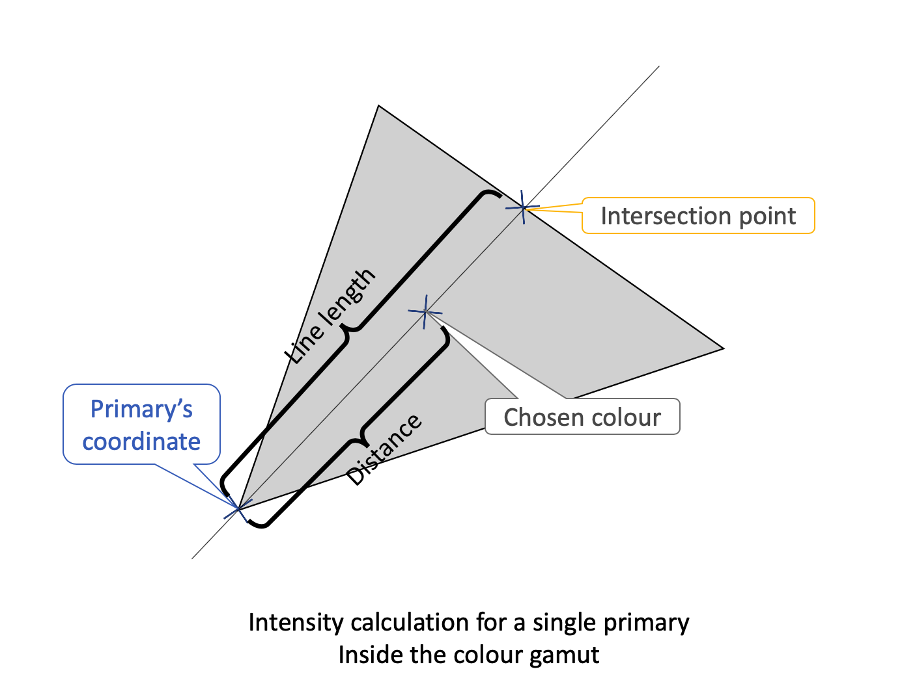
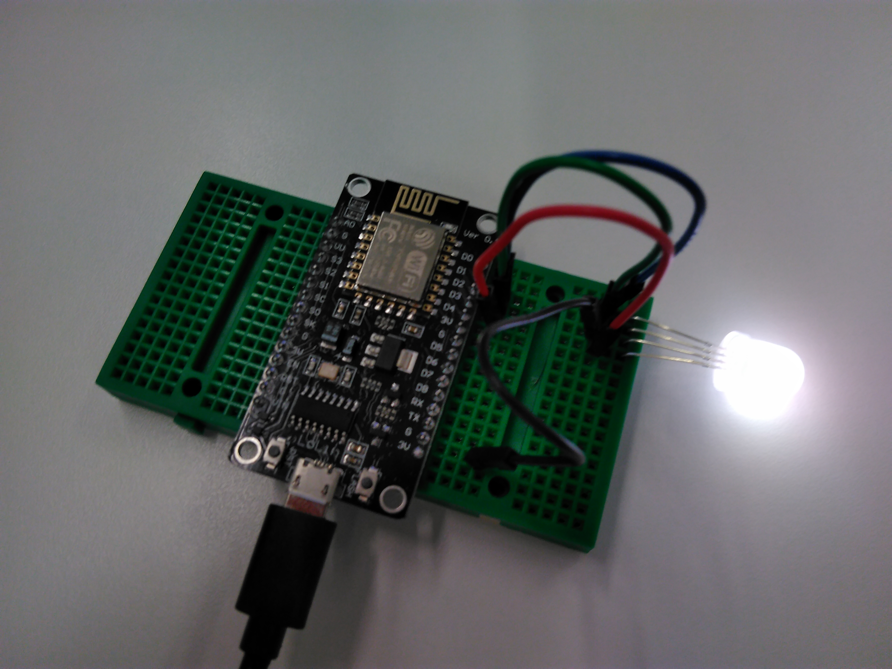

# MacGyver-ing in vision science - interfacing systems that are not supposed to work together

>Angus MacGyver is the main character of a famous television series from the 1980's called MacGyver. He is portrayed as a good person, who wants to save good people from bad people. Instead of using guns and violence, his talent lies in improvising: he always achieves his goal by coming up with simple and clever solutions.  
> Some of the solutions shown in the TV series do actually work in real life, like the one where he once fixed a car with an egg.

### **All the workshop material is added into a single page to make searching easier.**
Nobody expects you to read all this! Just find what you want, no hard feelings.

Here we are. We have an experiment to do, and you are recording using two completely different proprietary systems, and you want to make sure your data won't be garbage. You can try getting support from the manufacturers, but even if they bother to respond (provided they still exist), don't expect them to solve this problem for you. To them, you are the single tiny problematic customer, who wants to do weird things on what something you call science. Once you have explained your problem to them, they probably see it as an eccentric academic's whim, and certainly not something they can make money from.  
Imagine the company's side: a Doctor Nameless Jane shows up, who is probably very famous in her field, claims to have a problem and requests insider information that may be used to release a competing product. Doesn't look suspicious at all, huh? :) Also, would you halt your current development projects and dedicate some of your talented engineers for a few weeks to solve a problem for someone who may reply with a thank you note after all this is done?  

Sadly, this is my experience with about 40-50% of the companies I have interacted with as a scientist. I have seen total incompetence ('what do you mean there is a fault?'), arrogance  ('you are using it wrong') and ignorance (took months to reply).  

Anyway, I guess now you get the idea, and see why it looks so tempting to take the matter into your own hands.  
**Don't do it, unless you don't have any other choice!**  
When you are in a situation where you have to let out your inner MacGyver, you are doing high-risk work, and you may compromise your data. You may not notice this at the time, and then later-on when something goes wrong, you will have to stand up to your boss and say 'I blew it'.  
Or worse, when you are the boss, and you have to retract a paper. Or even worse, many years later other people fail to replicate your work, and they find the opposite effect!

## How NOT to work with independent systems

These are just a few examples, and this list is very far from comprehensive. People can be very talented in collecting bad data.

- **Use separate workstations, control each system independently**
How do you know the timings of the systems match? You can use the equivalent one of these of course:

This is a clapperboard, and is used in film making. It has been used since the 1930s when films began to contain audio which was recorded separately. When top bit closes, it creates a clap-like sound, and all you have to do is to look for a match between the picture and the audio. Depending on the skill of the sound engineer, and assuming that the recording speeds are the same, the picture will be in sync with the audio. Or not. This is still a problem today (for a very different reason through), and there is at least one [video player software](https://www.vlchelp.com/syncing-audio-vlc-media-player/) that can manually alter the picture-sound delay.  
But is this method suitable for your data? Probably not.
- **Simultaneously starting and stopping recording**
Modern digital systems will have a latency. This means that the recording will not start and stop in the very moment when you press the button or send the command. For most applications this is fine. Say a normal user doesn't care if the social media site displays 10-15 milliseconds later. But can you afford not to care?
- **Adjusting calibration settings offline, after data connection.**
This mostly applies for motion tracker and virtual reality combo systems, but can be extrapolated to others too. Converting between coordinate systems after you finished collecting data from participants is very error-prone. I have seen this on a VSS workshop a year or two ago.  

***

# How can you interface different systems in vision science?

## Annotating things with TTL

[TTL](../glossary.md) stands for Transistor-Transistor Logic, and is pretty much the de-facto standard for interfacing with various digital systems.  
The idea is to use binary signals to start/stop data acquisitions: When I was a Masters student, I made a flash gun to be used with an MRI machine. The idea was that my device would trigger the data acquisition sequence, and it would also produce a given number of flashes in specified intervals. I had to go through a lot of training just to get into the equipment room, and my device had to be tested several times to prove that it won't damage the very expensive MRI machine.  
Most devices have an external trigger input, or at the very least they are capable of recording changes in a TTL line. If you like, this is the modern-day equivalent of the clapperboard.  
Usually, manufacturers allow you to get access to their TTL input/output pins, so getting the state and the timing information is reasonably straightforward. For example the [DATAPixx](https://vpixx.com/products/datapixx/) has some TTL inputs, and I have used these in the past. Accessing data in Matlab is easy using the code bundled with [Psychtoolbox](http://psychtoolbox.org/docs/Datapixx).

### The good old photodiode-blu-tacked-on-the-monitor approach
Here is when things begin to get complicated: Say you are making a vision experiment, and you want to know exactly when your visual stimulus appears. You use a CRT monitor, because your boss said so or you don't have anything else at hand. You want to do this by attaching a photodiode to the monitor, and draw a black or white square on the screen where your photodiode is along with your visual stimulus.  
I guess (hope? :) ) it's no surprise to you, but the CRT monitor is working with a scanning electron beam, which very quickly produces the picture, line-by-line, and it's our flicker-fusion threshold that cheats us into believing that we are seeing a steady picture. This means that the photodiode patch you are illuminating via software is actually a bunch of impulses, like these:
 

The top trace shows the 'raw' signal on the photodiode attached to a CRT monitor, looking at a blinking patch as a function of time on an oscilloscope. The bottom trace is the signal that goes to the TTL input of the data recorder I used.  
In here, I made a compromise: I only cared about the timing accuracy of the onset of the patch.  
How do you clean up the photodiode's signal to make a nice and neat TTL signal? Instead of some complicated microcontroller-based approach, I went with the simple and elegant one: I am charging and discharging a capacitor at different rates with the signal coming from the photodiode. Since the charge and discharge cycles are taking different times, I can easily mask the effect of the scanning electron beam: When the spike comes, I quickly charge my capacitor, and when it goes, I let it discharge much much slower. Here is the circuit for it:

I used this circuit in my PhD project when I worked with very precisely delivered visual stimuli. Here is how the circuit works:

- When the photodiode 'sees' light, it triggers the `IC1A` comparator
- The capacitor in the middle gets charged virtually immediately (well, about 2-3 microseconds)
- When the light is gone, the capacitor discharges through the `IC1A` comparator through the `Filter delay` potentiometer over about 100 milliseconds.
- `IC2A` just makes sure that TTL output is nice and rectangular, and it also drives `LED1` so I could see if the device was triggered.

**Don't think that just because you use LCD monitors or projectors, you are out of the woods, and you don't need this device!**
In LCD monitors, and in newer LED projectors, the brightness is controlled by dimming the backlight or the light source. They do this dimming by [PWM](../glossary.md), and you get virtually the same problem: instead of the scanning electron beam, you will get a pulse-width-modulated optical signal passing through the LCD panel.  
You can get a fancy monitor that has the first pixel's bits available as TTL outputs which would make this whole thing redundant, but it's far less common than the photodiode approach.  

### What coupling to use?

Sometimes, especially when recording electrical activity, noise contamination can be a massive problem, making your life difficult. A little creature like a baby zebrafish or a honeybee will not produce large electrical signals, so the electrophysiology set-up (electromyography, extra-cellular recording) will have to deal with something in the range of microvolts.  

When I was an undergraduate, I once 'helped' a professor. I built a fancy analogue amplifier that exploited metastability in TTL gates, and we wanted to do some recordings. Unfortunately, due to my faulty design and because back then I knew even less about recording signals from a living organism than I do now, this didn't work out. I used mains ground as a reference, and when we recorded, I could beautifully measure the mains-originated electrical buzz at the electrode, instead of taking a cardiogram.  
The poor professor ended up with garbage data, and he lost the opportunity to publish some papers in a highly competitive field, and a year or so later he showed me that someone else published the data he wanted to capture with me. I think he forgave me, but I still feel bad about it.  

What was the problem? Effectively, my grounding system ended up functioning as an antenna, and since I used a massive gain, it recorded pretty much everything, except the signal we wanted. It even started to oscillate on its own once.  
This phenomenon is called a [ground loop](http://www2.elo.utfsm.cl/~elo352/biblio/telefonia/Ground%20loop%20basics.htm), and while I was familiar with this in radio systems, I never thought it is possible with a living organism too. Until then, that is.  

What I should have done is to keep my amplifier isolated, by powering at least the first stage from a battery, and use a different recording method. If I had the same problem with something that uses weak analogue and digital signals, such as an Electroencephalography set that can also record events happening on a bunch of TLL lines simultaneously, I would have used optical coupling: I would have flashed an LED, and the closely coupled photodiode's signal would go into the TTL inputs of the data recorder. You can get these in as a [single integrated circuit](https://www.vishay.com/docs/83725/4n25.pdf), and it doesn't need many other components.  
There are many coupling methods, but the two relevant ones for us are:

- **Galvanic coupling**, where you literally connect things with wires
- **Optical coupling**, where you use light to convey information

Galvanic coupling is easier, but if you suffer from noise for any reason, going optical may help.

## Condition code annotation with TTL, serial port or over the network

Let's say you have a vision experiment where you have to deliver stimuli with high temporal precision. Let's also say that that you have many conditions where the stimulus looks different, but you only have a single-channel recorder, and you must to record the entire experimental session into one big file, and then find and sort the corresponding conditions.  
The simplest way to do this is to increase the number of photodiode patches, and you can use a combination of digital signals. One patch would still be for timing, and you could use the rest of them for making condititon codes. For example, I used a four-channel photodiode-TTL adapter in my PhD project, and it looked like this:

The power supply circuitry in the bottom right corner is a bit fancy, I needed that to elevate the voltage a little bit.  
Perhaps a better approach would have been to use a serial port to tell the data recorder system which condition is coming next, and just use the single channel for timing annotation. An even more sophisticated approach would have been to use a NodeMCU device to [send a UDP packet](https://www.arduino.cc/en/Tutorial/WiFiSendReceiveUDPString) to [Matlab](https://www.mathworks.com/help/instrument/read-and-write-binary-data-over-udp.html) over the local network, and just save the data in there.

## Temporal verification and calibration verification

In my PhD project, I wanted to replicate someone else's findings, and to do this, I had to deliver a visual stimulus that was temporally modulated. I spent months of designing the experiment, collecting data and analysing it, and I just couldn't replicate the findings of the original paper.  
Then, on one day I realised that I have inserted an `if()` statement in the wrong part of my render loop, and I effectively flooded my own signal with noise.  
I repeated the experiment, and the signal now was finally there, but it looked weird, like if I had some extra delay in my visual stimulus. I verified my timings with the photodiode circuit and the oscilloscope, and it proved to be correct. Then I checked the timing accuracy between the waveform recording and the TTL recordings, and I found that there is a timing error between the two: the signals that I knew were correctly delivered, didn't have the same time index on the analogue and digital side. And to put the icing on the cake, about 40 minutes into the recording, the system said that my next TTL signal is 40 minutes before I even began the recording! I would have saved months of confusion by not taking specifications for granted.  

A related issue that is worth mentioning is the importance of verifying calibration. This applies to pretty much everything, including displays, motion trackers, flash guns or VR headsets or chopping machines. Is the built-in calibration working OK? Are there any anomalies within the space? Is 50% display value properly corresponding to 50% luminance output? Is a 100 mm ruler actually 100 mm according to the instrument?  

Guess the moral of the story is to verify that the thing actually works with a simple set-up before just diving in and using it in production-quality experiments.  

## Using NodeMCU board as a data logger

Like every microprocessor system, the NodeMCU measures time with a simple counter that is derived from its own clock source. In Arduino this manifests as the `millis()` and the 'micros()' counters. These counters are 32-bit ones, so they start from 0 during power-up, and they will overflow (return to zero) after reaching the value of 4294967295 (2^32 - 1). With `micros()`, this happens about every 17 minutes, and with `millis()` this happens every 280 hours or so.  
If you can live with this, just carry on using the `millis()` and `micros()` counters, simple is good.  

However, if you want something nicer, you can use the Arduino's built-in example for using [Network Time Protocol](http://www.ntp.org/documentation.html) servers, but there is a [direct implementation available too](https://tttapa.github.io/ESP8266/Chap15%20-%20NTP.html). All you need is access to the Internet, and sync with your local NTP server.  

If you are offline, you can make a time server from a NodeMCU board and a GPS receiver with a PPS (pulse-per-second) output. You will find my implementation [in one of my repositories](https://github.com/ha5dzs/PPS-ntp-server). You can also use your very own atomic clock module, but I haven't been able to grab hold of one yet.

You can save some values you captured to the [SD card](../sd_code.md).

## 'Precise' timing with the NodeMCU board

If you are a real precision freak, you can go [low-level](https://sub.nanona.fi/esp8266/timing-and-ticks.html) with the NodeMCU board. But first a bit of explanation.  

In today's desktop computers, we use Complex Instruction Set Computing (CISC) processors. This means that there are a large number of instructions available to the programmer, most of them are specific for complex operations, like floating-point division. This means that you don't have to write additional code to do these operations manually in the Assembly programming language and put it in a subroutine. However, this makes the physical implementation of a processor rather complex and many operations can only be done in a number of steps. In this case, it means a lot of clock cycles. In the Zilog Z80 (the processor found in the famous ZX spectrum, for example) [there are instructions that require more than 16 clock pulses](http://map.grauw.nl/resources/z80instr.php) to complete.  
In machines that use Reduced Instruction Set Computing (RISC) architectures, there are fewer instructions, but they operate much faster, in 1-2 clock pulses.  

So this means that the ESP8266 clocked at 80 Mhz performs about as well as an Intel i486 processor, approximately.

It is possible to fetch a counter from the machine cycles, and use that as a time base.  
However, beware with these, because the NodeMCU board is busy doing other things in the background, and accessing low-level features might interrupt the operation of other hardware. For example, when you set up a [hardware interrupt](../concurrency.md) and trigger it while the board transmits something over WiFi or UART, you might well end up transmitting garbage.  

I checked the timing accuracy of `delayMicros()`, and found that there is an extra 5-6 microsecond delay in addition to what I specified when I used it to pulse a logic pin. For example, when I set a delay of 200 microseconds, the actual delay is about 206 microseconds, as seen on the oscilloscope:

I think this is more than sufficient precision for vision science applications, but if you want more, now you know how :)

### [Download code here](arduino_examples/MicrosecondBlaster/MicrosecondBlaster.ino)

## Creating visual stimuli with the NodeMCU board

When it comes to generating visual stimuli using a monitor, it is imperative that the gamma correction is properly done, i.e. the display value-luminance output relationship is linear. 
However, when you want something simple, such as a blinking uniform visual stimulus, you may well be better off using dedicated hardware to create it.  
As pulse-width-modulation is by principle linear, so you can easily set visual stimuli to be displayed with particular luminance values, and reasonable timing accuracy.  
Of course this is not just limited to a single LED, any GPIO pin can be driven with PWM, and you can even make some primitive LED matrix displays yourself.  

However, please be aware that if you use a large number of LEDs, you need to give them separate power supplies and switch them on and off using a transistor.

## Measuring colours a bit more accurately with the TCS sensor and the NodeMCU board

When I looked at the [TCS RGBC Sensor's](../tcs_code.md) implementation, I found that the detected colours are weird and the reported colour temperature values are not realistic.  
I think the problem was that the sensor's colour filters were not taken properly into account, and therefore it's not returning the correct values. I wrote about this very briefly in my [other repository](https://github.com/ha5dzs/colour_sensor_primary_calculator), and came up with a Matlab script that calculates the primary colours of the sensor using their spectral response. Of course, there are manufacturing tolerances, so this will be as accurate as a decent instrument, but well, its cost is only 2-3 dollars or so. I got it to within 10% though. Hope you can use it!  

I made an implementation which displays the results on the [OLED](..//oled_code.md) screen. The wiring description is inside the code.

### [Download code here](arduino_examples/NodeMCU_colorimeter/NodeMCU_colorimeter.ino)

## Creating a calibrated D65 (or any other chromaticity coordinate) light source

I think, this was pretty much the most complicated project from the workshop examples. When I was a PhD student, I replaced my room light with a bunch of RGB LEDs, and used a commercially available controller for creating white light. It didn't quite work, because the colours were ever so slightly off, but the results were still quite amazing.  

Currently, commercially available white LEDs are actually blue or violet LEDs that excite a phosphor player covering the LED chips. You can see this yellow layer in a white LED with a clear enclosure, which contains the phosphor. Their spectral range is quite limited, and overly heavy on the blue. It has been particularly difficult making 'warm white' LEDs, because the exact phosphor composition has not been found until very recently.  

However, with RGB LEDs, you ideally shouldn't have this problem, you can match the colours from the three primaries just like in any other display. Well, this controller kinda did it, and it was truly amazing. Every colour in my room got far more vivid. The red carpet I had was almost glowing, the greens were beautiful deep greens like a laser pointer, and the blues were rich blues, almost UV-esque. Almost unrealistic. I can't describe this any other way, but to me, it was an absolutely life changing experience. But the controller was displaying colours that were slightly off, which annoyed me a great deal.  

So, given that I can measure the primaries, I came up with the following code:

- **Specify the primary chromaticity coordinates and relative intensity values**
- **Check whether the requested colour is actually displayable**:
Effectively, the gamut is a triangle, and I found a [little mathematical trick](http://mathworld.wolfram.com/TriangleInterior.html) that I can use if we are within the gamut
- **Calculate the required intensity values**:
Now this was the difficult bit! Now that we have established that we are within the gamut, it becomes a matter of geometry. If we draw a line between a primary and the chosen colour, we will find three points. These are (1) the primary's coordinates, (2) the chosen colour's coordinates, and (3) the intersection coordinates of said line and the line formed between the two primaries, on the opposite side of the colour gamut. This is kinda difficult to take it in at first, so here is the same thing on a figure:  

So, in the code, **distance** is between a primary's coordinates and the chosen colour's coordinates. **Line length** is the distance between primary's coordinates and the intersection point's coordinates. 
- **Calculate the** required intensities and **PWM values**:
Now we can see that the intensity will be inversely proportional to the ratio of distance and line length, it is possible to calculate the required intensity levels. But these intensities will need to be divided by the measured intensities as not all primaries are equally luminous. To get the PWM value the LED should be driven with, all we need to do is to multiply the drive value with the maximum PWM value permitted in the system. And then:

According to the chromameter I had access to, the LED's chromaticity coordinates were within the 7% range from what I requested. Of course, the devil lies in the details: While the chromaticities of the primaries remain stable, the light output of the diodes vary heavily due to manufacturing tolerances and temperature. I replaced the LED with a different one and the colours were slightly off. Also, since chips inside the LED are not close enough to each other, the 10 mm diffuse body doesn't really do a good job at making the light homogenous.

I have also made the same code in Matlab, perhaps it's easier to read.

### [Download Matlab code here](ColourMixer.m)

### [Download Arduino code here](arduino_examples/ColourMixer/ColourMixer.ino)

As for the various colour temperatures, the simplest solution is to use a lookup table, as the the functions for this purpose are approximate and will introduce more error.

## Interfacing other systems

Unfortunately, I have to say, you are on your own with this. Hopefully the practices I showed you will help you, but every system will have its own quirks and downright idiocies, which can be exploited differently. And again, all this is just a last resort, and most of the trouble can be avoided by buying the proper equipment.  
However, if the damage is already done and you have to work with an unsupported piece of junk everybody wishes it would burn in hell forever, it will be time to embrace your inner MacGyver, and get stuff to work!

# Future work

I'll incorporate the feedback I get, I might upload some other stuff. The code and examples are free for non-commercial use, and if you do use something, please credit it.

# Thanks!

I'd like to thank:
- Tony Van Roon and his [fantastic website](http://www.tonyvanroon.com) I came across when I was a kid, and wrote an article series about the 555 timer in the school newspaper based on his work
- Robert Volcic, my PI, for putting up with me
- Jenny Read, my PhD supervisor, who also have put up with me when I made the TTL box, the LightZapper and LightMatcher devices
- Ferenc Szendi and Carl Gaspar for doing some tests on my code and help me clear up some stuff.
- and thank YOU, for bothering enough to read all this! :)
