# Preparing your Arduino enviromnent

Since tbe [Arduino IDE](https://www.arduino.cc/en/Main/Software) is cross-platform, these steps are going to be very similar on Windows, Mac, and Linux.  
However, since the [board](nodemcu_intro.md) is not an Arduino product, you will have to install the board support package, and some libraries.

## Step 1: [Download and install](https://www.arduino.cc/en/Main/Software) the Arduino IDE

It's OK to use the version provided by the app store of your platform if there is one available. This way, you can get automatic updates, which is nice.

## Step 2: Install the [ESP8266 board support package](http://arduino.esp8266.com/Arduino/versions/2.0.0/doc/installing.html)

Here's how:
-  **Go to 'File -> Preferences'**:
For future reference, the path found at 'Sketchbook location' is where all your Arduino-related software and libraries are going to be located. You can move this directory across computers, and you will have your own environment available on tap without having to download everything from the Internet. 
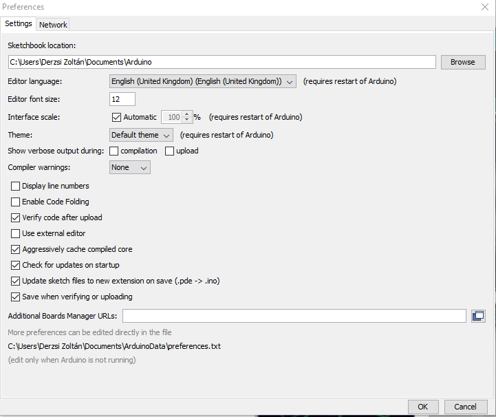

- **Add the following link to 'Additional Boards Manager URLs:'**
`http://arduino.esp8266.com/stable/package_esp8266com_index.json`
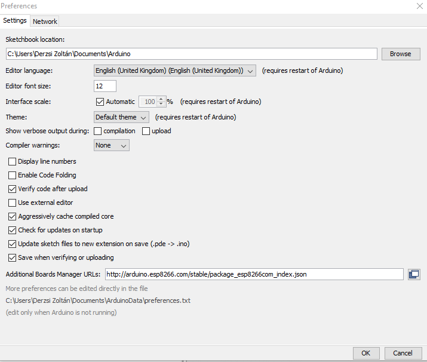

- **Go to 'Tools -> Board -> Boards Manager'**
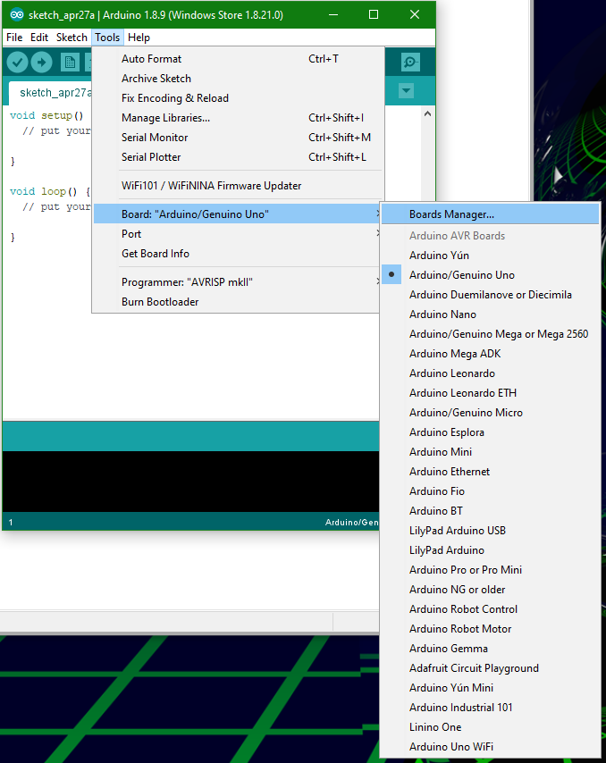

- **Search for 'ESP8266' and install the package**
If offered, install the latest non-beta version.
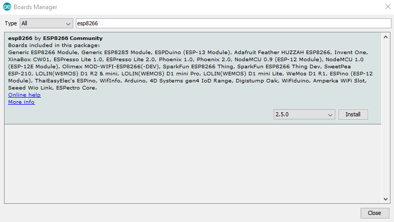

## Step 3: Connect the board to you computer

The board is using a USB-to-Serial chip to communicate with the ESP8266 chip. Recent operating systems (Windows 10, OSX High Sierra, and Linux kernel 4.2.1 and above) won't need external drivers, and everything should load fine.  

On windows, you can check Device manager:
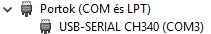  
On Linux, the serial port will be something like `/dev/ttyUSB0`.  
On Mac, the same serial port will be something like '/dev/cu.usbserial-XXXX', where `XXXX` is usually a four digit number.

If you are using something old/exotic and the driver is not found automatically, [try this Windows driver](https://github.com/HobbyComponents/CH340-Drivers), or head to the manufacturer's website for the appropriate factory-supported [Windows](http://www.wch.cn/download/CH341SER_EXE.html) or [Mac](http://www.wch.cn/download/CH341SER_MAC_ZIP.html) driver. You will most probably need Admin permissions for your system.  
If you are using Linux and you don't have the CH340 module compiled, you can [try this one](https://github.com/juliagoda/CH341SER).

## Step 4: Select the board and the appropriate serial port
- **Go to 'Tools -> Boards' and select 'NodeMCU 1.0 (ESP-12E module)'**
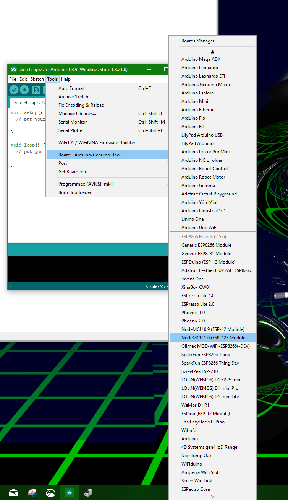
- **Go to 'Tools -> Port' and select the device's serial port**
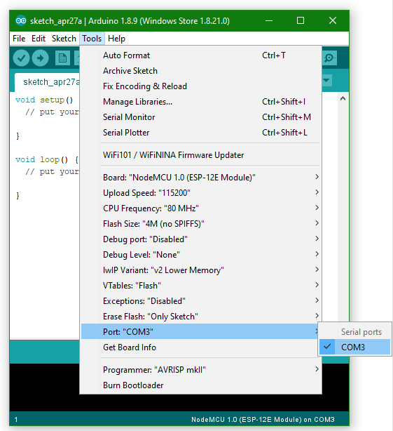

**NOTE:**  
Your port will probably be different. If you have more ports, try to find out which one is the one you need.

## Step 5: Install the libraries the IoT kit requires
**Go to: 'Tools -> Manage Libraries...', and install the following:**
- Adafruit SSD1306:
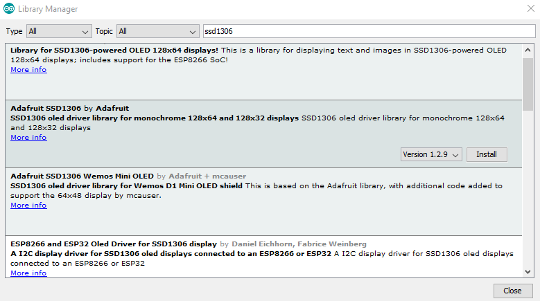
- Adafruit GFX library:
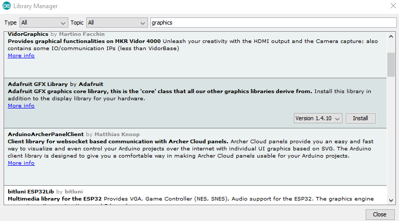
- Adafruit BME 280:
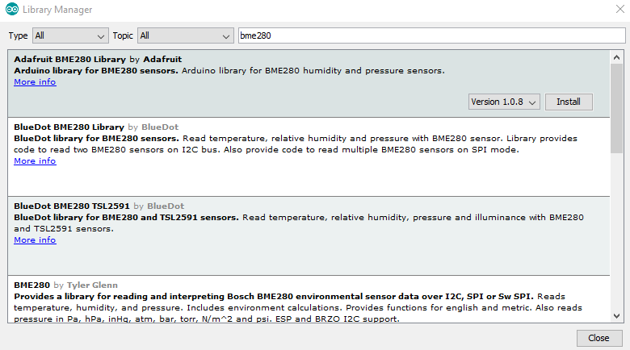
- TCS34725:
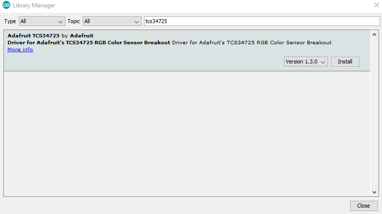

## Step 6: [Compile and load your first firmware!](getting_started.md)