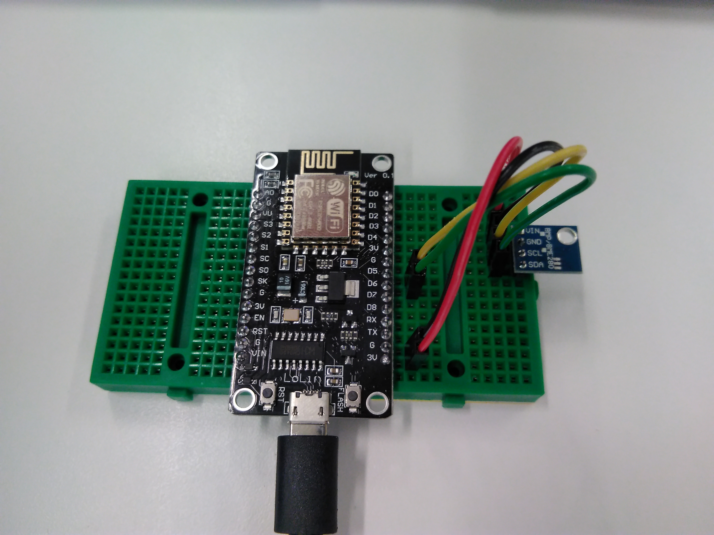
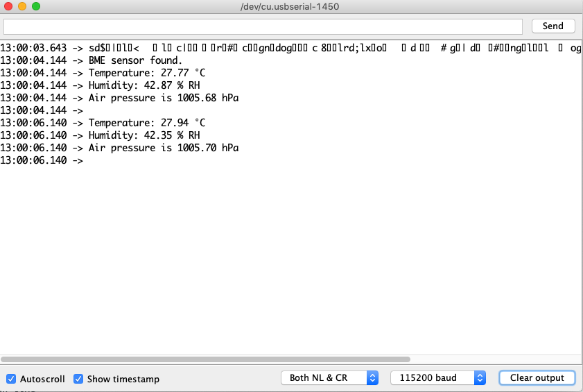

# Reading the BME280 sensor

Before trying this example, [make sure you can upload code to your board](getting_started.md), and you have [downloaded the required libraries](arduino.md). We will also use [some debugging techniuqes](debug.md) too.

In this example, we will read the included Bosch [BME280]((https://www.bosch-sensortec.com/bst/products/all_products/bme280)) environment sensor. It is connected to the NodeMCU board via [I2C](glossary.md), and is powered from the board itself. The measurements are sent back via the [UART](glossary.md), so we can see the values in the serial monitor.

## Assemble the following circuit



You can use any '3V' and 'G' pins to supply power to the sensor. The `SCL` and `SDA` pins are connected to `D5` and `D6`, respectively.

| NodeMCU board pin | Wire colour | Sensor pin | What is this |
|:------------:|:------------:|:---------:|:--------:|
| 3V | Red | VIN | The 3.3V power supply for the BME sensor |
| G | Black | GND | The ground for the sensor |
| D5 | Yellow | SCL | The `SCL` (clock) I2C line |
| D6 | Green | SDA | The `SDA` (data) I2C line |

### Change the sensor I2C address in the library file to 0x76

**In a future library version, you may not need to do this, because the library's [current version on GitHub](https://github.com/adafruit/Adafruit_BME280_Library/blob/master/Adafruit_BME280.h) includes the alternate address, and this change did not propagate to the Arduino library manager as of April 2019.**

Before we begin, we need to modify a `#define` in the BME library's header file, because the sensor uses different addresses depending on what kind of power supply it gets. Since we use 3.3V, we need to change this address manually:  

** Go to your Arduino directory, then: `libraries/Adafruit_BME280_library`, and edit `Adafruit_BME280.h`. Look for this in the code:
```
/**************************************************************************/
/*! 
    @brief  default I2C address
*/
/**************************************************************************/
    #define BME280_ADDRESS                (0x77)
```

...and change the address to `0x76`, like so:

```
/**************************************************************************/
/*! 
    @brief  default I2C address
*/
/**************************************************************************/
    #define BME280_ADDRESS                (0x76)
```

## How does the code work?

The code initialises the I2C bus on the dedicated pins using `Wire.begin()`, and uses the created `bme_sensor` object to access sensor-specific functions. During initialisation, it's also handy to do error management:

```
Wire.begin(SDA_PIN, SCL_PIN); // This initialises the I2C bus on the pins we assigned

if(bme_sensor.begin())
{
  // If we got here, the sensor got found.
  Serial.println("BME sensor found.");
}
else
{
  // If we got here, the BME sensor didn't initialise.
  Serial.println("The BME sensor could not be initialised. Is it connected properly? Is it powered? Have you edited the header file?");
  while(1); // This makes sure nothing else happens
}

```
Then, in the `loop()` function, we repeatedly get the sensor's latest data, and we print it out over the UART.  
When you open the serial monitor (in Arduino, go to 'Tools' -> 'Serial monitor'), you will see the statements from the code, if you set your baud rate to 115200.



When you press RESET on the NodeMCU board, you will see some other lines appearing too:

In the serial monitor, there are some characters that look garbage because it was transmitted at a lower baud rate, and is coming from the ESP chip's bootloader. We don't need to worry about these.  
```
12:58:35.753 -> BME sensor found.
```
This one came from the `setup()` function, and means that the sensor was found on the I2C bus.

```
12:58:35.753 -> Temperature: 27.70 °C
12:58:35.753 -> Humidity: 41.04 % RH
12:58:35.753 -> Air pressure is 1005.62 hPa
12:58:35.753 -> 
12:58:37.727 -> Temperature: 27.84 °C
12:58:37.727 -> Humidity: 40.71 % RH
12:58:37.727 -> Air pressure is 1005.70 hPa
12:58:37.764 -> 
```
...and this is the data it measures and we send back in the `loop()` function. It's nice and warm in here :)

# [Download the code here](arduino_code_files/bme_sensor/bme_sensor.ino)

