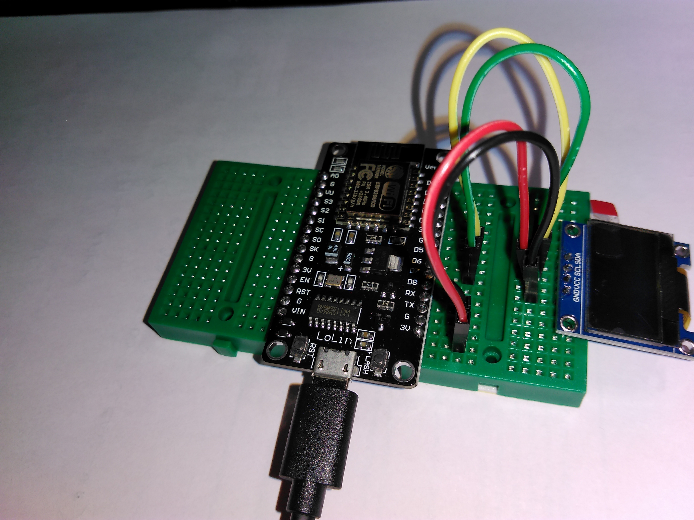

# Using the OLED display

Before trying this example, [make sure you can upload code to your board](getting_started.md), and you have [downloaded the required libraries](arduino.md). We will also use [some debugging techniuqes](debug.md) too. Additionally, it would help if you [read how the Adafruit GFX library works](https://learn.adafruit.com/adafruit-gfx-graphics-library?view=all). While the included [SSD1306 OLED screen](https://cdn-shop.adafruit.com/datasheets/SSD1306.pdf) can only use a fraction of its capabilities, the same library can be used with a large number of different displays.

## Assemble the following circuit

The display is powered from the NodeMCU board's 3.3V supply, and is communicating via [I2C](glossary.md). **Since the OLED screen uses little organic LEDs in its pixels, the power consumption is proportional with the number of pixels lit. Additionally, displaying the same information for a long time will result in burnt-in pixels.** If you are conscious about the power you are consuming, you can reduce the power consumption by simply inverting the display when more than 50% of the pixels are lit. To reduce burn-in, you could add a random pixel offset to everything you want to display every few minutes or so.  

| NodeMCU board pin | Wire colour | Display pin | What is this |
|:------------:|:------------:|:---------:|:--------:|
| D6 | Green | SDA | The `SDA` line of the I2C bus |
| D5 | Yellow | SCL | The `SCL` line of the I2C bus |
| 3V | Red | VCC | Power, +3.3V |
| G | Black | GND | Ground |

## How does the code work?

Let's separate the code to accessing the display and displaying things on it. The OLED screen is connected via the I2C bus, it does not have a reset pin. Since these displays can come in all sorts of shapes and sizes, the display resolution has to be set manually: 
```
#define OLED_WIDTH 128
#define OLED_HEIGHT 64
#define OLED_RESET -1

// Create the display's C++ object.
Adafruit_SSD1306 oled_display(OLED_WIDTH, OLED_HEIGHT, &Wire, OLED_RESET);
```
In this case, the [address operator](programming_in_c.md) is used in the display's obejct declaration to annotate that it's being connected via I2C. These displays may come with other interfaces too, such as SPI or parallel.  
The display itself is set to generate an internal 5V power supply to drive the OLED pixels internally, and its I2C address may change. In the code, this looks like:
```
oled_display.begin(SSD1306_SWITCHCAPVCC, 0x3C)
```

As for driving the display, we rely on the [Afafruit GFX library](https://learn.adafruit.com/adafruit-gfx-graphics-library?view=all). Which makes the job much easier. Here are a few things to consider:

- The piece of memory where the display information is stored (aka 'frame buffer') is in the main memory of the NodeMCU, so if you use the display, you will have less RAM available.
- From frame-to-frame, the the frame buffer does NOT get cleared, you have to do it manually.
- After updating the frame buffer, you have to instruct the screen to display it.
- I2C is a SLOW bus, don't expect to render things with a high frame rate

Additionally, the Adafruit GFX library-specific quirks are that:

- Not all functions make sense with this display:
It only displays black and white, does not support shades or colours, for example.
- Fonts have to be included in the code spearately:
This is because the fonts are generated bitmaps, and will take up program memory
- Fonts may have different anchor points from which the pixel offsets are calculated:
Normally it's the string's top left corner, but 'nice' fonts use the bottom left corner, and you have set these offsets manually. The [library's documentation](https://learn.adafruit.com/adafruit-gfx-graphics-library?view=all) will tell you exactly how this works.
- Setting the display to scroll does not increase the amount of data that can be displayed

**Every displayed frame should be something like this:**  
- Clear the display, set font, set scale and set cursor position:
```
oled_display.clearDisplay();
oled_display.setFont(); // Empty font
oled_display.setTextSize(1);
oled_display.setCursor(0, 0);
```
- Add the information you want to show:
```
oled_display.println("First line");
oled_display.println("Second line");
oled_display.println("Third line");
oled_display.setTextColor(BLACK, WHITE); // The next line will be inverted
oled_display.println("Inverted text");
oled_display.setTextColor(WHITE);
```
- Update the display with the changed frame buffer contents
```
oled_display.display();
```

# [Download the code here](arduino_code_files/oled_display/oled_display.ino)