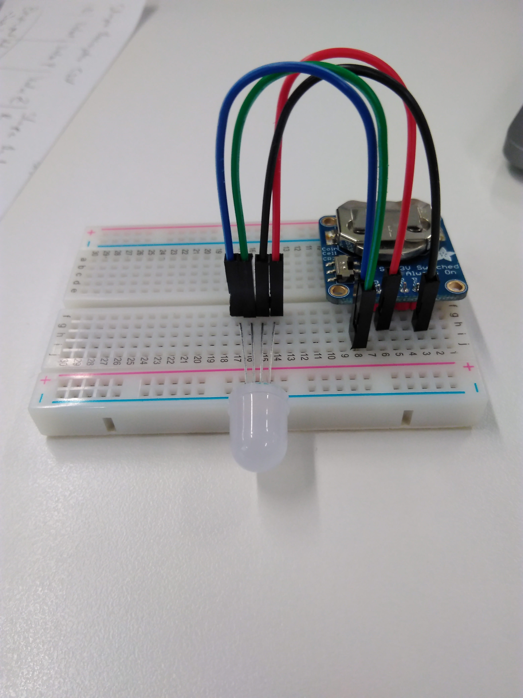
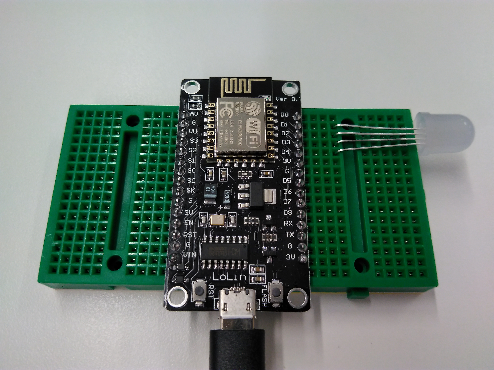

# Blinking LED with weird colours

Before trying this example, [make sure you can upload code to your board](getting_started.md).

In this example, we will drive the RGB LED with [PWM](glossary.md) on each colour channel. The RGB LED has four pins: the longest one is the common cathode. If you look at the four pins, the pin-out is `B-G-C-R`:


The different colours of wires represent the colour channels in the LED. The black wire is the common cathode.

## Assemble the following circuit:

In this circuit, we use the GPIO pins as a current source and a current sink. This is usually not recommended practice, but it's perfectly acceptable for the purpose of driving an LED. We will use the PWM outputs to mix the LED's colour, and we also use one GPIO pin to control the flow of current, effectively turning the LED on and off.  

| NodeMCU board pin | Wire colour | LED pin | What is this |
|------------|------------|---------| -------- |
| D0 | N/A | Shortest | This is the blue channel |
| D1 | N/A | Medium length (the one next to it) | This is the green channel |
| D2 | N/A | Longest | This is the common cathode |
| D3 | N/A | Medium length (the one on the other side) | This is the red channel |
  
  
The code has two main parts. The first part is the hardware initialisation:
```
void setup() {
  // put your setup code here, to run once:
  
  // Set pin directions 
  pinMode(RED, OUTPUT);
  pinMode(GREEN, OUTPUT);
  pinMode(BLUE, OUTPUT);
  pinMode(C_CATHODE, OUTPUT);

  // Set PWM ang logic levels
  analogWrite(RED, 0);
  analogWrite(GREEN, 0);
  analogWrite(BLUE, 0);
  digitalWrite(C_CATHODE, 0);

  
  randomSeed(8472);  // Change the seed of the random-number generator

}
```
The appropriate GPIO pins are set to outputs, and they are controlling current differently: The PWM pins are controlled with `analogWrite()` to create a 0% duty cycle signal, and we use `digitalWrite()` make sure the current flows through the common cathode.  
The `randomSeed()` function adjusts the randomness of the [software-implemented random number generator](https://www.arduino.cc/reference/en/language/functions/random-numbers/random/).  

The second part of the code is where the fun happens:  
```
void loop() {
  // put your main code here, to run repeatedly:

  digitalWrite(C_CATHODE, 0); // turn on the LED
  analogWrite(RED, random(0, 255)); // Set a random duty cycle between 0 and 100%
  analogWrite(GREEN, random(0, 255)); // Set a random duty cycle between 0 and 100%
  analogWrite(BLUE, random(0, 255)); // Set a random duty cycle between 0 and 100%

  delay(500);

  digitalWrite(C_CATHODE, 1); // Turn off the LED
  
  delay(500);

}
```
In every loop iteration, we are turning on the LED, and setting some random values for the PWM outputs. We keep the LED on for 500 milliseconds. Then, we turn it off and keep it off for 500 milliseconds.

# [Download the code here](arduino_code_files/rgb_blink/rgb_blink.ino)