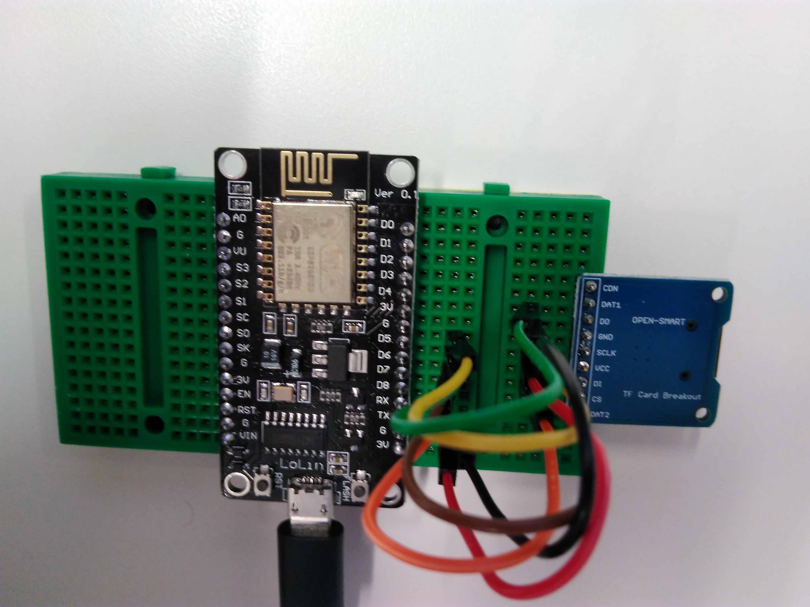

# Accessing the SD card

Before trying this example, [make sure you can upload code to your board](getting_started.md), and you have [downloaded the required libraries](arduino.md). We will also use [some debugging techniuqes](debug.md) too.

In this example, we will use the [FAT32](https://support.microsoft.com/en-us/help/154997/description-of-the-fat32-file-system) file system on the card, and we will access the card using [SPI](glossary.md) mode using the NodeMCU's Hardware SPI.  

## Assemble the following circuit

If you check the [pinout of the NodeMCU board](nodemcu_intro.md), you will find the hardware SPI pins. In this case, since we are using one peripheral on the SPI bus, only one Chip Select pin is required.

| NodeMCU board pin | Wire colour | Card socker pin | What is this |
|:------------:|:------------:|:---------:|:--------:|
| - | N/A | CON | This pin is not used. |
| - | N/A | DAT1 | This pin is not used. |
| D6 | Green | DO | `HMISO` (Hardware Master In Slave Out) pin |
| G | Black | GND | Ground |
| D5 | Yellow | SCLK | `HSCK` Clock for the SPI |
| 3V | Red | VCC | Power, +3.3V |
| D7 | Brown | DI | `HMOSI` (Hardware Master Out Slave In) pin |
| D8 | Orange | CS | `CS`: Chip Select |
| - | N/A | DAT2 | This pin is not used. |

## How does the code work?

In the code, we use [Arduino's internal SD card library](https://www.arduino.cc/en/Reference/SD). Since we use the SPI hardware in the NodeMCU board, there is very little code necessary to do file manipulation.

- We need to initialise to card to access it:
```
// Initialise the SD card
if(SD.begin(CS_PIN))
{
  // If we got here, it's all good.
  Serial.println("SD card found.");
}
else
{
  // If we got here, we couldn't initialise the card.
  Serial.println("Could not find the SD card. Is it plugged in? Is it wired up correctly? Is it powered?");
  while(1); // Make sure the code won't proceed.
}
```
- We open the file, do some file operation:
```
// Create a file
the_file = SD.open("the_file.txt", FILE_WRITE);
if(the_file)
{
  Serial.println("File opened.");
}
else
{
  // If we got here, we couldn't create the file.
  Serial.println("The file couldn't be created. Is your card read-only?");
  while(1);
}

 // Write into the file
 the_file.println("This is some text in the file.");
 Serial.println("File written to.");
```
- ...and once finished, close the file:
```
// Close the file
the_file.close();
the_file.flush(); // Make sure the card finished saving stuff.
Serial.println("File closed.");
```

A few things to consider:

- **Always try to include error management.**
If something fails, halt execution by an infinite loop, and let the user know.
- The `the_file` object will be `false` when the file couldn't be opened.
- Opening a file in read-only is safer
- **If you don't close your files often enough, you risk losing data when a reset or power failure occurs**
- **If you write files really often, you will damage the SD card:**
A single cell of flash memory [can only be written to](http://www.ni.com/product-documentation/10126/en/) about 100000 times. The SD card controller can detect flash wear, and will re-allocate your file, so it will work, but the SD card's capacity will gradually shrink.
- **Do not use the SD card as a back-up device**, as [it only keeps the data](http://www.ni.com/product-documentation/10126/en/) for about 10 years.
- Do not connect the card to a 5V power source or a device that uses 5V logic levels. It will kill your card
- You can permanently protect an SD card and you can encrypt its contents
- **SD cards cheat with performance:**
When you just finished writing a file to the SD card, it's actually not yet been written to the flash memory. This is because [flash memories are slow](http://www.ccs.neu.edu/home/pjd/papers/hotstorage09.pdf), and they get slower over their life span. So to keep the customer (you) happy, the SD card controller temporarily caches the file, and it pretends that the write operation was successful. Later-on, when the flash memory has some spare time, the controller will eventually write it to the flash memory. And if a power failure or reset happens during this time, you will lose your file. This is why it's important to use `flush()` (and to eject your flash drives from your computer...).

In the serial monitor (Tools -> Serial Monitor), you will see the following messages:

- These are messages from the bootloader

```
12:12:08.431 -> tail 8
12:12:08.431 -> chksum
```

- This is what you should see when the SD card is properly connected, properly initalised, and everything is working.

```
12:12:08.484 -> SD card found.
12:12:08.528 -> File opened.
12:12:08.528 -> File written to.
12:12:08.528 -> File closed.
12:12:08.528 -> File opened for reading.
12:12:08.528 -> The file's content is:
12:12:08.528 -> This is some text in the file.
12:12:08.528 -> 
12:12:08.528 -> File closed.
```

- This is what you should see when the code tries to initialise the SD card, but the card is not present. When a hardware failure like this occurs, the bootloader's safety Watchdog timer (`WDT`) will reset the board and will try again.

```
12:22:54.283 -> Could not find the SD card. Is it plugged in? Is it wired up correctly? Is it powered?
12:22:57.188 -> 
12:22:57.188 -> Soft WDT reset
12:22:57.188 -> 
12:22:57.188 -> >>>stack>>>
12:22:57.188 -> 
12:22:57.188 -> ctx: cont
12:22:57.188 -> sp: 3ffffda0 end: 3fffffc0 offset: 01b0
12:22:57.188 -> 3fffff50:  feefeffe feefeffe feefeffe feefeffe  
12:22:57.222 -> 3fffff60:  feefeffe feefeffe feefeffe feefeffe  
12:22:57.222 -> 3fffff70:  feefeffe feefeffe feefeffe feefeffe  
12:22:57.222 -> 3fffff80:  feefeffe feefeffe feefeffe feefeffe  
12:22:57.222 -> 3fffff90:  feefeffe feefeffe feefeffe 3ffee834  
12:22:57.222 -> 3fffffa0:  3fffdad0 00000000 3ffee800 40204f84  
12:22:57.222 -> 3fffffb0:  feefeffe feefeffe 3ffe84fc 40100d19  
12:22:57.222 -> <<<stack<<<
12:22:57.259 -> 
12:22:57.259 ->  ets Jan  8 2013,rst cause:2, boot mode:(3,7)
12:22:57.259 -> 
12:22:57.259 -> load 0x4010f000, len 1384, room 16 
12:22:57.259 -> tail 8
12:22:57.259 -> chksum 0x2d
12:22:57.259 -> csum 0x2d
12:22:57.259 -> v951aeffa
12:22:57.259 -> ~ld
12:22:57.332 -> 
```
There are several more examples bundled with the Arduino software, which allows even finer control of the SD card.

# [Download the code here](arduino_code_files/sd_card/sd_card.ino)
