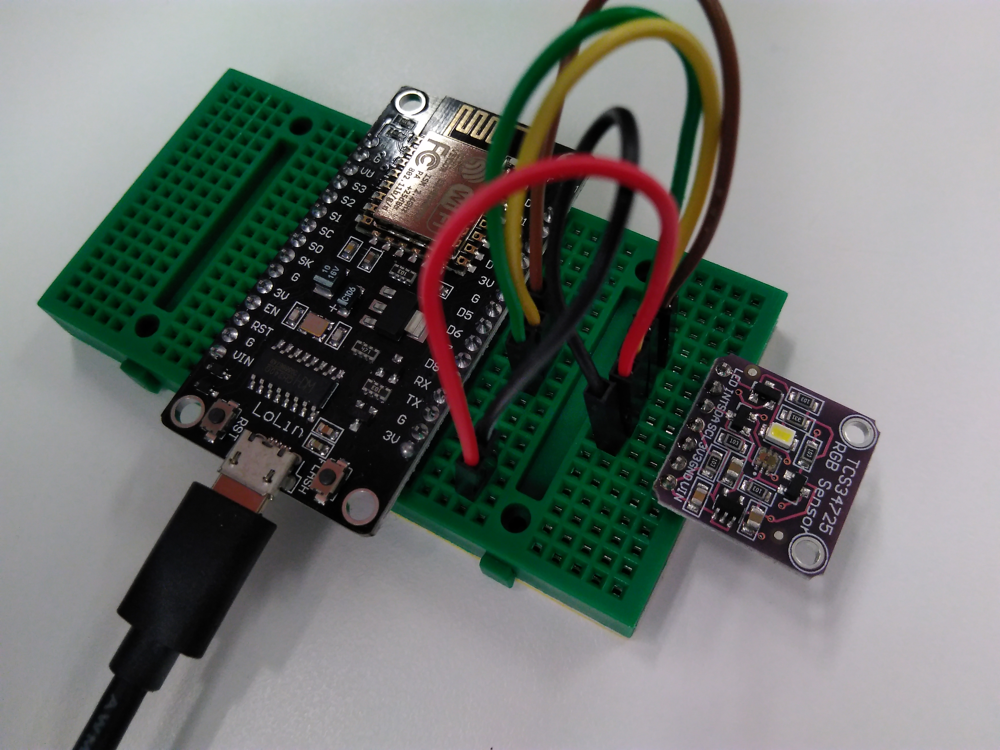

# Reading the colour sensor with the Adafruit libraries

Before trying this example, [make sure you can upload code to your board](getting_started.md), and you have [downloaded the required libraries](arduino.md). We will also use [some debugging techniuqes](debug.md) too.  
In order to try this example, please download the `.ino` file at the bottom of the page.

In this example, we will use the included [TCS23725](https://cdn-shop.adafruit.com/datasheets/TCS34725.pdf) colour sensor, with [Adafruit's](https://github.com/adafruit/Adafruit_TCS34725) Arduino library. In addition to the red, green and blue primaries, it has a clear channel, and a built-in 'white' LED.  
Inside the chip, the photodiodes are connected to an integration circuit and a programmable amplifier. The integration time can be set in 7 steps between 2.4 and 700 milliseconds. The gain can be adjusted in 4 steps. It also has an INT pin that can be used to [trigger interrupts](concurrency.md) in a computer system.  

The built-in [ADC](glossary.md) for each channel is 16-bits, so the returned values will be between 0 and 65535.

## Assemble the following circuit

The sensor is powered from the board's 3.3V supply. It is connected via the I2C bus (`SDA`: `D5` and `SDA`: `D6`). The built-in LED is turned off connecting its pin to the ground, and we don't use the INT pin.

| Board pin | Wire colour | Sensor pin | What is this |
:------------:|:------------:|:---------:|:--------:|
| G | Brown | LED | This is the control pin for the LED. |
| - | N/A | INT | This pin should not be connected anywhere. |
| D6 | Green | SDA | The `SDA` (data) I2C line |
| D5 | Yellow | SCL | The `SCL` (clock) I2C line |
| 3V | Red | 3V3 | The 3.3V power supply for the TCS sensor |
| G | Black | GND | The ground for the sensor |
| - | N/A | VIN | Not used, it's for an external power supply |


## How does the code work?

The code initialises the I2C bus on the dedicated pins using `Wire.begin()`, and uses the created `bme_sensor` object to access sensor-specific functions. During this initialisation, we are passing over some settings for the sensor, which are defined in the header file:
```
Adafruit_TCS34725 tcs_sensor = Adafruit_TCS34725(TCS34725_INTEGRATIONTIME_101MS, TCS34725_GAIN_16X);; // This is the sensor's C++ object.
```
In this case, we have set the integration time to 101 ms, and the sensor gain to be 16 times. These settings can be changed with the `setGain()` and `setIntegrationTime()`. During initialisation, it's also handy to do error management:

```
Wire.begin(SDA_PIN, SCL_PIN); // This initialises the I2C bus on the pins we assigned

  if(tcs_sensor.begin())
  {
    // If we got here, the sensor got found.
    Serial.println("TCS sensor found.");
  }
  else
  {
    // If we got here, the TCS sensor didn't initialise.
    Serial.println("The TCS sensor could not be initialised. Is it connected properly? Is it powered?");
  while(1); // This makes sure nothing else happens
}
```
Continuing on, we can change the sensor settings, and once everything is set, we can let the user know:
```
// Now we can continue with configuring the sensor
tcs_sensor.setInterrupt(false); // This one disables the interrupt pin

// Just for the hell of it, let's change the gain and the integration time.
tcs_sensor.setGain(TCS34725_GAIN_4X); // Reduce this gain if you saturate your sensor
tcs_sensor.setIntegrationTime(TCS34725_INTEGRATIONTIME_700MS);

Serial.println("Hardware initialised.");
```

When you [check the library](https://github.com/adafruit/Adafruit_TCS34725/tree/master/examples), you will see that there are a lot of functions available not just to control the sensor, but to interpret the data.  

In the `loop()` function we repeatedly query the sensor with this line:
```
tcs_sensor.getRawData(&red_value, &green_value, &blue_value, &clear_value); // Update the value with pointers
```
These work with C pointers, so this function directly accesses the variables that are given as input arguments. [Read this](programming_in_c.md) if you don't know what this means.  
The colour temperature is calculated from the ADC values, and then everything is returned to the user:
```
colour_temperature = tcs_sensor.calculateColorTemperature(red_value, green_value, blue_value); // Update the value as return value

// Now we print
Serial.println("R-G-B-C channel ADC values are: ");
Serial.print(red_value); // Print ADC value
Serial.print(", "); // Add a space
Serial.print(green_value); // Print ADC value
Serial.print(", "); // Add a space
Serial.print(blue_value); // Print ADC value
Serial.print(", "); // Add a space
Serial.println(clear_value);

Serial.print("Colour temperature is: ");
Serial.print(colour_temperature);
Serial.println(" Kelvin");
```

There is a delay to prevent flooding, and a typical output looks like this if you open the serial monitor (in Arduino, go to 'Tools' -> 'Serial monitor'), after you set your baud rate to 115200.  
In the serial monitor, there are some characters that look garbage because it was transmitted at a lower (9600) baud rate, and is coming from the ESP chip's bootloader. We don't need to worry about these.  
The statements from the `loop()` function are here:
```
14:40:18.955 -> TCS sensor found.
14:40:18.955 -> Hardware initialised.
14:40:19.669 -> R-G-B-C channel ADC values are: 
14:40:19.669 -> 1493, 1371, 859, 5705
14:40:19.669 -> Colour temperature is: 3457 Kelvin
14:40:19.669 -> 
14:40:22.377 -> R-G-B-C channel ADC values are: 
14:40:22.377 -> 1892, 1733, 1073, 4885
14:40:22.377 -> Colour temperature is: 3418 Kelvin
14:40:22.377 -> 

```
There are a lot of other functions. Check the comments in the library files to see how they work.
# [Download the code here](arduino_code_files/tcs_sensor/tcs_sensor.ino)
