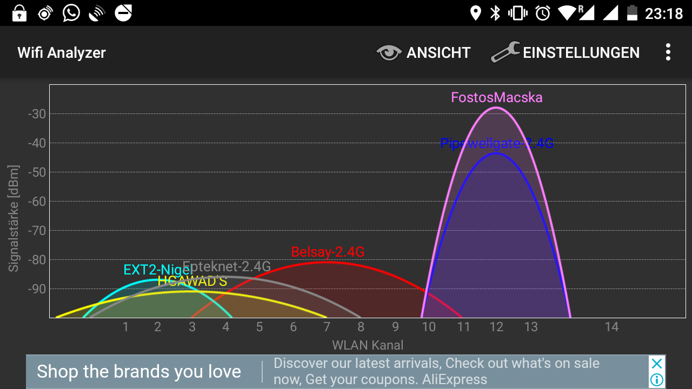
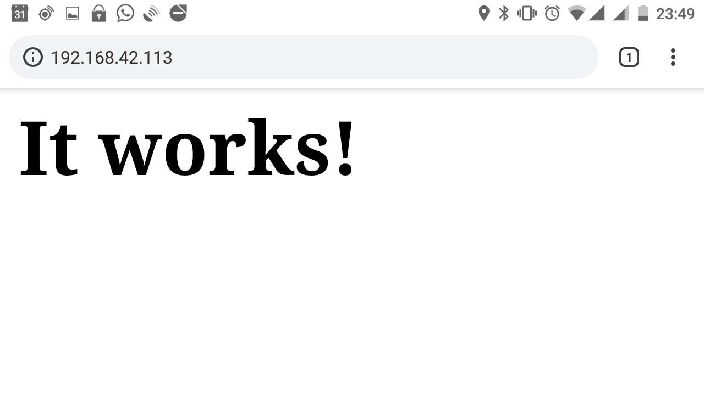

# Using the WiFi on the NodeMCU board

Besides the price, performance and power consumption, one of the most attractive features of the NodeMCU board is that it has integrated WiFi. This wireless network interface is accessible through the Arduino C-code, which makes the creation of network-enabled devices very easy. The use of this board is taking a large part of making the [Internet of Things](https://www.forbes.com/sites/jacobmorgan/2014/05/13/simple-explanation-internet-things-that-anyone-can-understand/#7c37f9761d09) a reality.  
In order to try this example, please download the `.ino` file at the bottom of the page.

## What can the Wifi module do?
According to the [datasheet](https://www.kloppenborg.net/images/blog/esp8266/esp8266-esp12e-specs.pdf) of the ESP-12E module found on the NodeMCU board, the WiFi module:

- Operates on the 2.4 GHz band
- Can handle transfer speeds up to 72.2 Mbit/s
- Works as a client, access point, and promiscuous (client and access point) mode
- Supports WPA and WPA2 security
- Up to 4 clients supported in access point mode


Before trying these examples, [make sure you can upload code to your board](getting_started.md), and you have [downloaded the board support package](arduino.md). We will also use [some debugging techniuqes](debug.md) too.

# Connecting to a local wifi network

We are using the built-in libraries to access the WiFi module. You have to initialise it, then specify the network details, and that's pretty much it!

```
#include <ESP8266WiFi.h> // WiFi library

// I guess this is not the most secure way of doing it :)
char* network_name = "Pipewellgate-2.4G";
char* password = "iamnotgivingyoumypassword";

void setup() {
  // put your setup code here, to run once:
  Serial.begin(115200); // Start serial port
  Serial.println("");
  Serial.print("Network: ");
  Serial.println(network_name);

  // Initialise Wifi.
  WiFi.mode(WIFI_STA); // client mode
  // Add network details
  WiFi.begin(network_name, password); // Where to connect

  // Simple progress bar stolen from the the WiFiClient example
  while (WiFi.status() != WL_CONNECTED) {
    delay(300);
    Serial.print(".");
  }
  
  Serial.println("");
  Serial.println("Connected!");
  Serial.println("The device's IP address is: ");
  Serial.println(WiFi.localIP());
}

void loop() {
  // put your main code here, to run repeatedly:

}
```


In the serial monitor, there are some characters that look garbage because it was transmitted at a lower baud rate, and is coming from the ESP chip's bootloader. We don't need to worry about these.  
If you look at the serial monitor (Tools -> Serial Monitor), after setting the baud rate to 115200, you will see the messages transmitted via the serial port:  
```
23:05:04.469 -> Network: Pipewellgate-2.4G
23:05:04.798 -> ..
23:05:05.070 -> Connected!
23:05:05.070 -> The device's IP address is: 
23:05:05.105 -> 192.168.42.113
```
### [Download the code here](arduino_code_files/wifi_client/wifi_client.ino)

# Creating your own access point

Creating the access point is also very simple:
```
/*
 * This code creates a WiFi access point.
 */

#include <ESP8266WiFi.h> // WiFi library

//
char* network_name = "FostosMacska";
char* password = "NagyonFostosAMacska";

void setup() {
  // put your setup code here, to run once:
  Serial.begin(115200);
  Serial.println("");
  Serial.println("Starting the access point.");

  WiFi.softAP(network_name, password); // This one creates the access point

}

void loop() {
  // put your main code here, to run repeatedly:

}
```
...and here it is, using the [Wifi Analyzer](https://play.google.com/store/apps/details?id=com.farproc.wifi.analyzer&hl=en) Android app:
  
The default IP address is `192.168.4.1`.

### [Download the code here](arduino_code_files/wifi_ap/wifi_ap.ino)

# Running a web server

The arduino libraries also come with web server support. It takes an extra couple of lines to add it:
```
web_server.on("/", serve_the_user); // Server path is root ("/"), and this is the function we execute
web_server.begin();
Serial.println("Web server started, now listening on Port 80.");
```
...and when there is an incoming request, the code calls the `serve_the_user()` function:
```
// This function is executed when there is a HTTP request.
void serve_the_user() {
  Serial.println("Serving incoming reauest now.");
  // This one can display any string, as long as it's proper HTML.
  web_server.send(200, "text/html", "<h1>It works!</h1>");
}
```
...and when you open the browser and type in the IP address of your web server (which is printed out in the serial monitor), you should see the following:



### [Download the code here](arduino_code_files/web_server/web_server.ino)